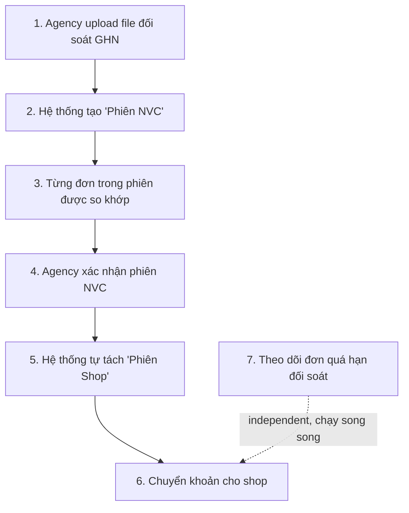

# [AGA] Đối soát: Tổng quan toàn bộ luồng — từ upload file đến tách phiên shop

## Mục đích

Tài liệu này tổng hợp lại toàn bộ luồng đối soát NVC (GHN/247Express) hiện có trong hệ thống, viết cho PO/stakeholder không cần đọc code vẫn hiểu được — kèm rõ phần nào **đã làm thật**, phần nào **đang giả lập/gap**.

## Luồng tổng quan (7 bước)

---

### Bước 1 — Agency upload file đối soát GHN

- Vào **Đối soát NVC → Phiên NVC → "Tạo phiên NVC"**, chọn file Excel GHN xuất ra, nhập ngày, ghi chú
- **⚠️ GAP:** hiện tại bước này chỉ là **thanh tiến trình giả** (chạy ngẫu nhiên cho có cảm giác đang xử lý) — hệ thống **chưa đọc nội dung file thật**. Phiên mới tạo ra dùng dữ liệu mock có sẵn, không phải trích xuất từ file vừa chọn.
- Để làm thật: cần thêm bước đọc file Excel (đã có thư viện `xlsx` dùng ở tính năng khác trong hệ thống), map đúng cột theo cấu trúc file GHN thật (đã xác nhận: Mã đơn GHN, Trạng thái, Tiền COD, 4 loại phí, Tổng đối soát...).

### Bước 2 — Hệ thống tạo "Phiên NVC" (phiên đối soát với nhà vận chuyển)

Mỗi phiên NVC đại diện 1 đợt GHN/247Express báo cáo & thanh toán cho đại lý, gồm:
- Tổng đơn, Tổng COD (GHN báo), Tổng phí dịch vụ (GHN báo), Nợ tồn, Phí chuyển khoản COD, **Thực nhận** (số tiền cuối cùng đại lý nhận từ GHN)
- Bên trong chứa nhiều **item** — mỗi item là 1 dòng ứng với 1 đơn hàng trong file GHN

### Bước 3 — Từng đơn trong phiên được so khớp (item-level)

Mỗi đơn được so sánh: GHN báo bao nhiêu COD/phí (`ghnCOD`/`ghnFee`) so với hệ thống tự ghi nhận bao nhiêu (`systemCOD`/`systemFee`) → ra 1 trong 3 trạng thái:

| Trạng thái | Ý nghĩa |
|---|---|
| ✅ **Đúng (MATCH)** | Số tiền GHN báo khớp với hệ thống ghi nhận |
| ❌ **Sai (MISMATCH)** | Có tìm thấy đơn nhưng số tiền lệch nhau |
| ⚪ **Không tìm thấy (NOT_FOUND)** | GHN báo 1 mã đơn nhưng hệ thống không tra ra đơn nào khớp |

**Insight đã xác nhận từ file GHN thật (~20.700 dòng):** 1 đơn hàng thường xuất hiện ở **2 thời điểm khác nhau** trong vòng đời — lúc lấy hàng (chỉ trừ phí, COD=0) và lúc giao xong (có COD, phí=0 vì đã trừ trước đó).

**⚠️ Đã thử và huỷ:** từng thêm trạng thái thứ 4 "Đang chờ COD (PENDING)" để tách riêng nhóm đơn giữa vòng đời khỏi nhóm "Đúng" — nhưng đại lý yêu cầu **giữ lại giao diện cũ**, không thêm trạng thái này (xem [them-trang-thai-dang-cho-cod.md](./them-trang-thai-dang-cho-cod.md), AGA-RECON-5, đã revert). Hiện tại các đơn giữa vòng đời vẫn hiển thị "Đúng" như trước.

**⚠️ GAP còn lại:** hệ thống hiện **chưa tự nối 2 lần xuất hiện của cùng 1 đơn lại với nhau** nếu chúng rơi vào 2 phiên khác nhau (2 đợt file khác nhau) — mỗi phiên vẫn xử lý độc lập. Muốn làm đầy đủ cần "ledger theo mã đơn xuyên suốt mọi phiên", việc này cần có bước đọc file thật (Bước 1) trước mới làm được.

### Bước 4 — Agency xác nhận phiên NVC

- Agency xem lại phiên, bấm **"Xác nhận"**
- Đây là bước quan trọng: chỉ khi xác nhận thì phiên mới được coi là chốt, tiền được ghi nhận là "đã chuyển khoản"

### Bước 5 — Hệ thống tự động tách "Phiên Shop"

- Ngay sau khi xác nhận phiên NVC, hệ thống **tự động nhóm lại các đơn theo shop** — vì 1 phiên NVC gồm đơn của NHIỀU shop khác nhau, nhưng đại lý cần biết rõ **từng shop** được bao nhiêu tiền
- Mỗi "Phiên Shop" hiển thị:
  - **Tổng phí DV (shop)** — phí đại lý thu của shop (giá bán có markup)
  - **Tổng phí DV (GHN)** — phí GHN thu thật của đại lý (giá vốn)
  - **Lợi nhuận ĐL** = phí thu shop − phí trả GHN *(mới thêm — trước đây có tính nhưng không hiện ở trang chi tiết)*
  - **Nhận về** = COD − phí shop (số tiền thực đại lý phải trả lại cho shop)

**⚠️ GAP đã biết:** chưa có bảng "giá vốn GHN" thật — số "Tổng phí DV (GHN)" hiện lấy từ dữ liệu mock có sẵn, không phải tính tự động theo hợp đồng GHN-đại lý (đã bàn và quyết định KHÔNG tự bịa công thức margin vì không an toàn).

### Bước 6 — Chuyển khoản cho shop

- **⚠️ Chưa làm** — tab "Chuyển khoản" hiện là placeholder ("Tính năng đang phát triển"), chưa có luồng thật để đại lý xác nhận đã trả tiền cho shop.

### Bước 7 — Theo dõi đơn quá hạn đối soát *(tính năng mới, chạy song song, không phụ thuộc luồng chính)*

- Tab riêng **"Quá hạn đối soát"**: liệt kê đơn đã "Giao hàng thành công" **quá 30 ngày** mà **chưa từng xuất hiện** ở bất kỳ phiên NVC nào — dấu hiệu GHN có thể đã bỏ sót, cần đại lý chủ động liên hệ xác minh
- Cố tình dùng **ngưỡng thời gian** (30 ngày) thay vì so sánh tức thời giữa trạng thái vận đơn và trạng thái file — vì 2 thứ đó lệch nhau về thời điểm là chuyện bình thường (GHN báo cáo theo kỳ), so tức thời sẽ báo sai liên tục

## Nguyên tắc nền tảng (áp dụng xuyên suốt cả luồng)

1. **Trạng thái vận đơn (tracking) ≠ trạng thái đối soát (billing)** — 2 hệ độc lập, không dùng cái này để suy ra cái kia (báo động giả vì GHN báo theo kỳ). Đã thử 1 badge so sánh tức thời ("Lệch tracking", AGA-RECON-8) nhưng đại lý xem demo xong yêu cầu gỡ bỏ, giữ nguyên giao diện gốc — bảng chi tiết phiên NVC chỉ còn đúng 3 trạng thái Đúng/Sai/Không tìm thấy như ban đầu.
2. **Không tự bịa số liệu tài chính** khi không có công thức/dữ liệu thật — thà để trống/gắn nhãn "gap" còn hơn hiện số sai
3. Mọi so sánh "lệch" đều được giữ nhưng phải NÊU RÕ đánh đổi (nhiễu nhiều/ít) — không âm thầm ẩn đi lựa chọn nào, để agency tự quyết dùng cơ chế nào phù hợp nhu cầu

## Tổng kết — đã làm vs chưa làm

| Phần | Trạng thái |
|---|---|
| Tạo phiên NVC, hiển thị chi tiết, so khớp COD/phí (3 trạng thái: Đúng/Sai/Không tìm thấy) | ✅ Đã có (dữ liệu mock) |
| Trạng thái "Đang chờ COD" cho đơn giữa vòng đời | 🔁 Đã thử, đã huỷ theo yêu cầu đại lý (giữ giao diện cũ) |
| Tự tách phiên shop sau khi xác nhận | ✅ Đã có |
| Hiện "Lợi nhuận ĐL" ở chi tiết phiên shop | ✅ Mới thêm |
| Tab "Quá hạn đối soát" | ✅ Mới thêm |
| Badge "Lệch tracking" (so sánh tức thời/cùng thời điểm) | 🔁 Đã thử, đã huỷ sau khi xem demo — giữ giao diện gốc |
| Đọc file GHN thật (parse Excel) | ❌ Gap — đang giả lập |
| Ledger cộng dồn theo mã đơn xuyên phiên | ❌ Gap — cần làm sau Bước 1 |
| Bảng giá vốn GHN thật | ❌ Gap — từ chối bịa số |
| Tab "Chuyển khoản" | ❌ Gap — placeholder |
